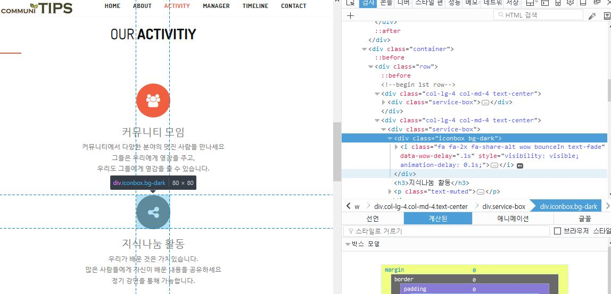

# 웹 파트 초스피드 내용 정리
html, css, jquery를 3분 안에 살펴봅니다

## HTML 기본지식
 - html은 태그를 통해 문법을 구성합니다.
 - 각각의 태그는 벽돌처럼 쌓는다고 생각합니다.
 - 쌓이는 순서는 위에서 아래로 입니다.
    - 예시
 

(오른쪽 위 개발자도구에서 **위에서부터 태그가 쌓인 순서대로** 웹페이지가 **출력** 되는 것 확인)

 - 각 태그는 `<p></p>` 쌍으로 여는 것이 있으면 닫는 것이 있어야 합니다

 - (쌍이 필요없는 태그도(ex: \<br\> 개행) 있지만 중요하지 않으므로 패스)


 - `<p><a></a></p>` 와 같이 태그 사이에 태그가 있으면 p가 부모, a가 자식이 됩니다.

 - **태그에 class를 지정하면 class에 따라 속성 부여 가능**, **id는 오직 하나의 태그에만 적용**


## HTML 주요 태그(벽돌)
|태그 이름| 설명|
|---|-----|
|html | 현재 문서가 html이라는 것을 나타내는 벽돌|
|header | 글자 인코딩, 문서 이름, import할 파일 등을 적는 벽돌
|body | body 안의 태그들이 실제 문서에서 보이는 내용들 입니다
|**p**| 단락 벽돌. 해당 태그를 통해 단락을 구분할 수 있다. 마지막줄에 띄어쓰기 적용
|**a**| 하이퍼링크 벽돌, href 속성에 링크 클릭시 보낼 주소 기입
|**div** | 태그의 가장 기본 단위, 형채가 없지만 위치를 갖고 있어 div를 통해 태그들을 집합으로 묶거나 div위치에 특정 태그를 동적으로 추가 가능
|style | CSS 문법을 쓸 수 있는 벽돌
|script | 해당 문서에서 사용할 js 파일의 경로를 적을 벽돌


# CSS
### 기본 개념
html의 정보를 스타일이 좋게 표현하도록, 디자인 을 지원하는 언어
ex )
```css
header{   ///헤더 태그의 속성을 정의
    border-bottom:1px solid gray;
    paddig:20px;
}
```

#### html에서 스타일링을 통하는 세가지 방법

1. internal style 방식 `<head>` 태그 사이에 `<style>`태그로 주는 방법

2. external css 방식 : <head>태그 사이에 외부 경로 삽입
```html
<link rel="stylesheet" type="text/css" url="외부css파일경로"\>
```
3. inline style 방식 : html 마크업 자체에서 속성값 지정

```html
<div style="background:#000; color:#fff;"></div>
```


#### 3초 문법
- `.` 은 클래스, `#`은 id.
- 클래스는 같은 이름의 클래스 태그에 모두 적용
- id는 오직 하나의 태그에만 적용
```css
/* `#selected`라는 id를 갖는 태그에 속성을 정의 */
#selected{    
    width:200px;               
    height: 600px;    
}

/* `.Myclass`라는 class를 갖는 모든 태그에 속성 정의 */
.Mycalss{
  width:200px;               
  height: 600px;   
}
```


# JQuery
## jQuery 기본 지식
 jQuery는 자바스크립트 DOM 작업을 쉽게 도와주는 third party 라이브러리

 - DOM(Document Object Model)이란?
    - 브라우저가 HTML 파일을 읽어서 마크업 태그와 1:1 매칭으로 DOM 객체를 생성
    - 웹 출력시 DOM 객체 사용

javascript 파일(.js 확장자 파일)에서 $() 축약기호로 jQuery객체를 리턴해 사용

`var $header = $("#header");` 처럼 jQuery 객체를 받는 변수는 앞에 $기호 해주는게 일반적

```js
var #id = $(#example).val()  /// example이라는 id값을 갖는 태그에 접근해 value를 출력
```

## ajax
js파일 내에서 데이터(data)를 특정 주소(url)로 보내는 방법 get과 post 방식이 있다
```js
var userinfo = {
  username: $("#username").val(), //#username 태그에 접근, valuse를 얻음
  password: $("#password").val()
};

$.ajax({//$ 은 jquery 를 뜻함. jquery에서 ajax함수를 쓴다는 뜻
      type: 'POST',
      data: JSON.stringify(userinfo),
      contentType: 'application/json',
      url: 'http://funfunbox.azurewebsites.net/join/login',
      success: function(data) {
          alert("로그인 완료");          
      }
  });
```
